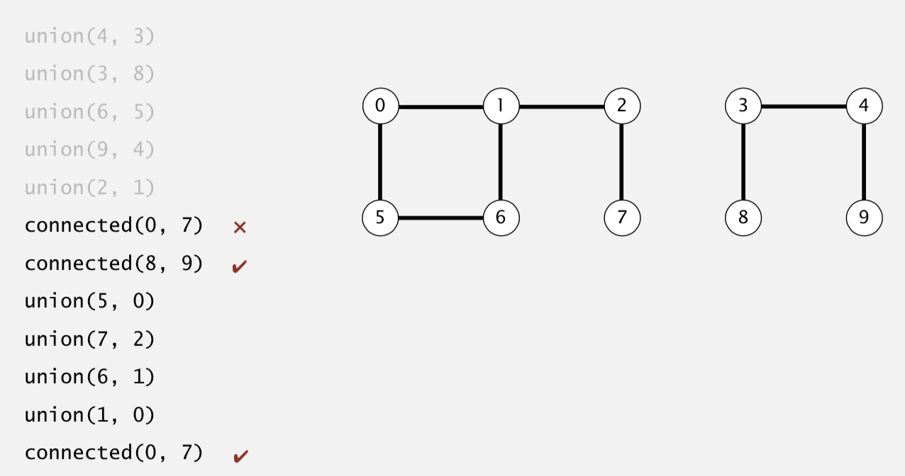
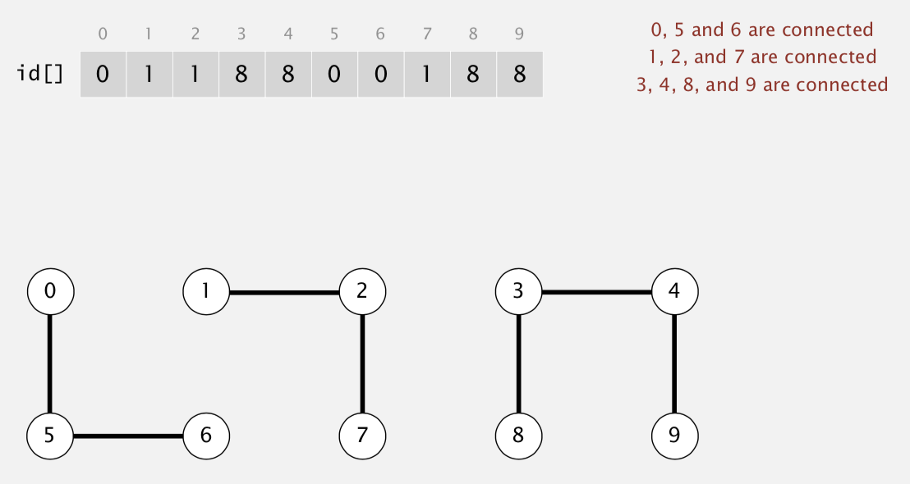
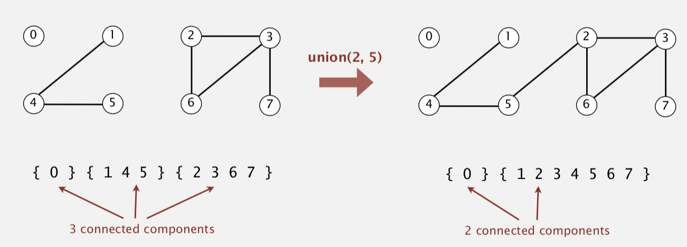

# UNION FIND: DYNAMIC CONNECTIVITY (1/5)
- `Quick Find`
- Quick Union
- Improvement: Weighted Quick Union
- Improvement: Weighted Quick Union + Path Compression
- Application: Percolations


## Problem: Is there a path connecting `p` and `q` ?
- Given a set of N objects
  - `union(p, q)` : a function that connects two objects
  - `connected(p, q)` : a function that returns where or not there is a path connecting the two specified objects 
  - Once two nodes are connected they can't be `unconnected`


# QUICKFIND (EAGER APPROACH)
## QuickFind Data Structure
- Integer Array `ids[]` of length N 
- Interpretation: `p` and `q` are connected if and only if they have the same ID

##  QuickFind Disadvantage: Expensive `union()` operation
- `N` union commands on `N` nodes takes `N^2` time, 
- It will take a lot of time to connect a lot of nodes

| `init()`      | `union()`     | `connected()`|
| ------------- |:-------------:| ------------:|
| N             | N             | 1            |






## SAMPLE CODE 
```
from QuickFind import QuickFindUF, QuickFindTests

print('------------')
QFT = QuickFindTests()
QFT.run_all_tests()
print('------------')

edges = [(4, 3), (3, 8), (6, 5), (9, 4),
  (2, 1), (8, 9), (5, 0), (7, 2), (6, 1)] 


UF = QuickFindUF(10)

for x, y in edges:
  print('current UF state:', UF.id)
  print('connecting nodes:', x, y)
  UF.union(x, y)

print('final UF state::', UF.id)

```
