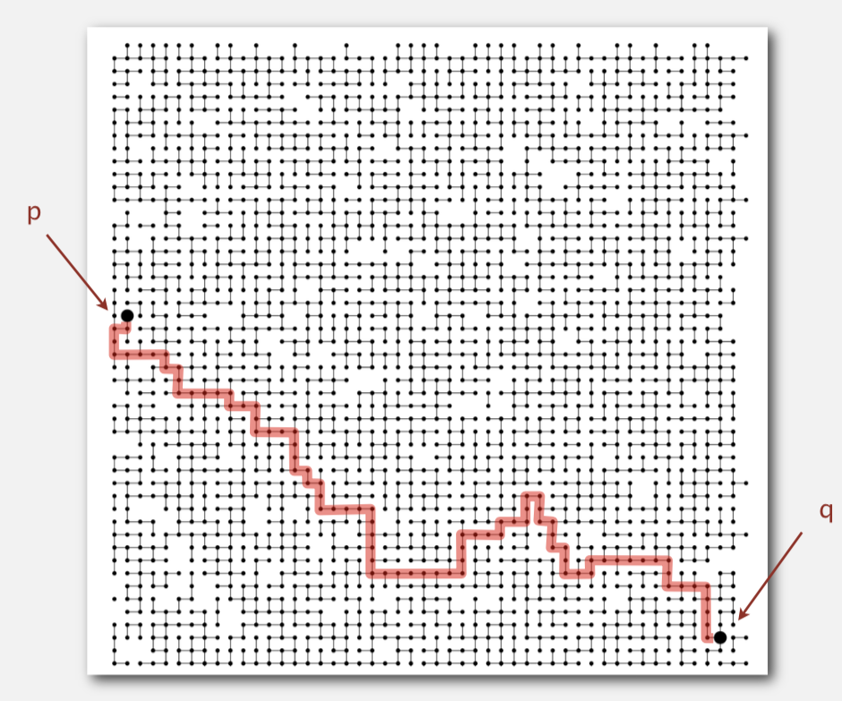
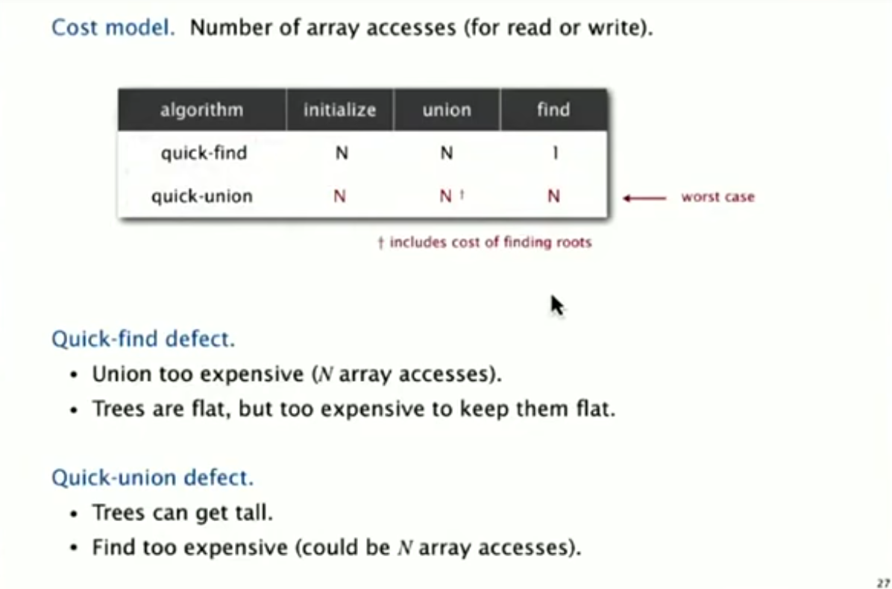
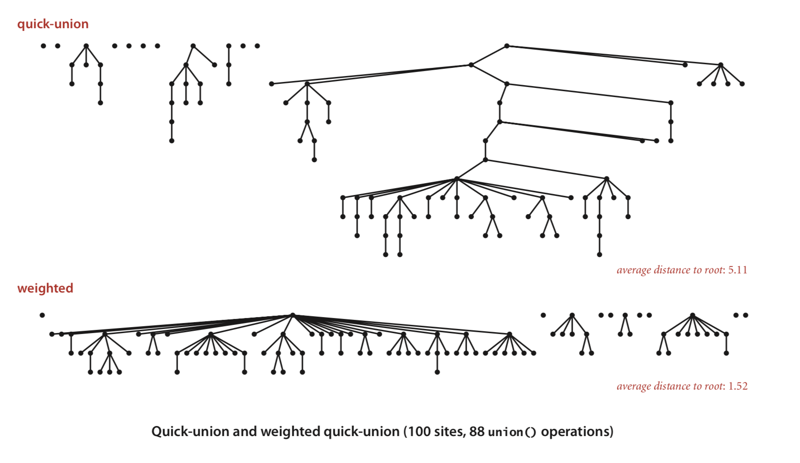
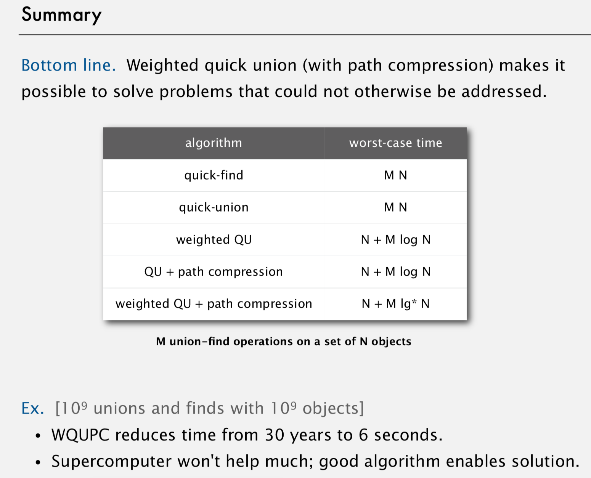

# TODO: 
- Make`WeightedUnionPathCompressionSinglePassUF` class
- Make`UnionPathCompressionSinglePassUF` class
- Make`WeightedUnionPathCompressionTwoPassUF` class
- Make`UnionPathCompressionTwoPassUF` class
- Add more complicated test cases 
- Compare run times of all algorithms presented using a case with large number of nodes, unions, and connected queries
- Make a base `UnionFindTests` class, where all test other classes inherit function from it 
- Convert video files to GIFs

# LECTURES FROM: Robert Sedgewick and Kevin Wayne.
# UNION FIND: DYNAMIC CONNECTIVITY 
- Quick Find
- Quick Union
- Improvement: Weighted Quick Union
- Improvement: Weighted Quick Union + Path Compression



## Problem: Is there a path connecting `p` and `q` ?
- Given a set of N objects
  - `union(p, q)` : a function that connects two objects
  - `connected(p, q)` : a function that returns where or not there is a path connecting the two specified objects 
  - Once two nodes are connected they can't be `unconnected`


# QUICKFIND (EAGER APPROACH)
## QuickFind Data Structure
- Integer Array `ids[]` of length N 
- Interpretation: `p` and `q` are connected if and only if they have the same ID

##  QuickFind Disadvantage: Expensive `union()` operation
- `N` union commands on `N` nodes takes `N^2` time, 
- It will take a lot of time to connect a lot of nodes

# QUICKUNION (LAZY APPROACH)
## QuickUnion Data Structure
- Integer array `id[]` of length `N` 
- Interpretation: `id[i]` is parent of `i`.
- Root of `i` is `id[id[id[...id[i]...]]]`.
- If `p` and `q` have the same root, then they are connected 
- To merge components containing `p` and `q`, set the `id` of `p`'s root to the `id` of `q`'s root.
##  Quick Union Disadvantage
- Trees can get too tall which means finding out if two nodes are `connected()` can get too expensive

# Recap and Discussion 



## Quick Find 
- IDEA 
  - if nodes are connected then they belong to the same set 
  - we assign a unique set id for each set
  - each node is assigned a set id, indicating they belong to that set
- CHECK IF TWO NODES ARE CONNECTED
  - if two nodes have the same id, then they are connected 
- CONNECT TWO NODES - UNION
  - when we connect two currently unconnected nodes (union) say node `A` and node `B`
  - we get the set ID of each node `A's id` and `B's id` 
  - remember that if a node has the same ID as `A` then it is connected to `A`
  - and also if a node has the same ID as `B` then it is connected to `B` 
  - so what we do is look at each node, 
  - if the node has the same ID as `A`, change the ID of that node to the ID of `B`
- ANALYSIS 
  - it is quick to know if two nodes are connected though, just check if they have the same ID 
  - everytime we connect two nodes we have to check all the nodes, it is time consuming


## Quick Union 
- IDEA
  - represent the connectivity of the nodes as a `tree` 
  - each node is assigned a number which represents itself
  - each node is assigned an id which is either itself, or its `parent`
  - if the node's id is itself, then it is a `root` since it has no parent
 - CHECK IF TWO NODES ARE CONNECTED 
   - to find if two nodes are connected, we check if they have the same root
   - to do that, we have to go up the tree, going to the parent of the parent of the parent...
   - of the node, until we get to the root
- CONNECT TWO NODES - UNION
   - if we connect two nodes `A` and `B`, we assign the id of `A` to the number representing `B` 
   - This makes node `B` the parent of node `A`
- ANALYSIS
   - it is quick to connect two nodes `A` and `B`..
   - just make the one of the nodes the parent of another node
   - To check if two nodes are connected, this might take a long time
   - because nodes are connected if and only if they have the same roots
   - and to get the roots you have to go up the trees..
   - which will take a long time if the trees are tall


# WEIGHTED QUICK UNION
- Modify quick union to avoid tall trees
- How to modify quick union to avoid tall trees?
  - Keep size of the track of each tree (number of nodes)
  - Balance the tree by linking the root of the smaller tree...
  - to the root of the larger tree. 
  - In other words, make the root of the the smaller tree...
  - the child of the larger tree. 
  


  
 ## WEIGHTED QUICK UNION DATA STRUCTURE
 - Same as quick-union except for the following differences
 - Maintain an extra array which keeps the number of objects of the tree with root `i`
 - size of tree = number of objects of that three
 - size of tree with root `i` stored at index `i` of array
 - CHECK IF TWO NODES ARE CONNECTED 
   - if nodes `A` and `B` have the same root, then they are connected
   - same as normal quick union 
 - CONNECT TWO NODES - UNION
   - to connect nodes `A` and `B`...
     - 1. get the the roots of nodes `A` and `B`, which defines each tree
     - 2. get the size (number of nodes) of the respective trees
     - 3. put the root of smaller tree as a child of larger tree
     - 4. update the size of the larger tree by adding the size (number of nodes) of the smaller now subtree


## WEIGHTED QUICK UNION ANALYSIS  
   - CONNECTED TWO NODES (UNION)
     - To connect two nodes, we need to "dig-up" the roots which takes time
     - weighted quick union will be faster than the regular one as "digging up" the roots because...
     - the tree is guarranteed to be flatter, the tree won't be that deep
   - CHECKING IF TWO NODES ARE CONNECTED
     - as with normal quick union... if two nodes are connected if the have the same root
     - We need "digging-up" the roots, discussion as mentions at 'UNION' algorithm 


   - STATEMENT: ` N >= 2^d` or ` log2 N >= d` where N - size of tree, d - depth of tree
     - the number of nodes of a tree is always greater than 2 raised to the "depth" of the tree
     - "depth" of the tree how many nodes you have to "touch"...
     - before you get to the farthest "leaf node", leaf nodes don't have "children" nodes
   - ANALYSIS of STATEMENT
     - for statement to be true: minimum size of tree > maximum depth increment 
     - 1. when you merge two trees the size doubles or more
     - 2. when you merge two trees the depth increases or stays the same 
     - Consider the simplest tree with one node, with a depth of zero
     - N = 1, d = 0
     - All trees start like this at the very beginning before any UNION
     - Then we connect two "simplest trees", the size doubles, depth adds 1 
     - N = 2 * 1, d = 1
     - Each time we do a union:
       - the size the tree size at least doubles and the depth increases at most one
```
              minimum       maximum
 # Unions |    Size N    | depth
    0            1         0
    1          2*1         1
    2          2*2*1       2
    3          2*2*2*1     3
    4          2^(4)*1     4
    .            ...       .
    d          2^(d) *1    d
 
 Which proves
` N >= 2^d` or ` log2 N >= d` where N - size of tree, d - depth of tree
``` 


     
# MORE IMPROVEMENT: INCLUDE PATH COMPRESSION 
 - IDEA A. Each time you compute the root of a node p...
   - ... you can make p's root its parent to make the tree flatter
 - IDEA B. BETTER THAN IDEA A: When you compute the root of a node p...
   - ... notice that the root of all touched (examined/traversed) nodes
   - ....until we get to p's root, all have the same root (which is p's root). 
   - ... so we can make the parent of all of those nodes to be p's root...
   - ... the tree will be so flat! 
 - IDEA C. TWO PASS IMPLEMENTATION
   - We can implement IDEA B by taking note of all examined/traversed node...
   - ... when we find the p's root...
   - ...then setting the `id` or parent of all these nodes to their root. 
 - IDEA D. SIMPLER ONE PASS VARIANT
   - Better implementation than IDEA C. Every time we find the root of node p,
   - Until we find the root, we make the parent of every other node its grandparent
   - This halves the path length. 
   - This won't take long, because the tree will never be too tall anyway if we do weighted quick union. 


# CONCLUSION
- Weighted quick union with path compression is the fastest (WQUPC)
- WQUPC is practically linear time. 
- It is proven that no linear time algorithm exists for this problem (not discussed here)

