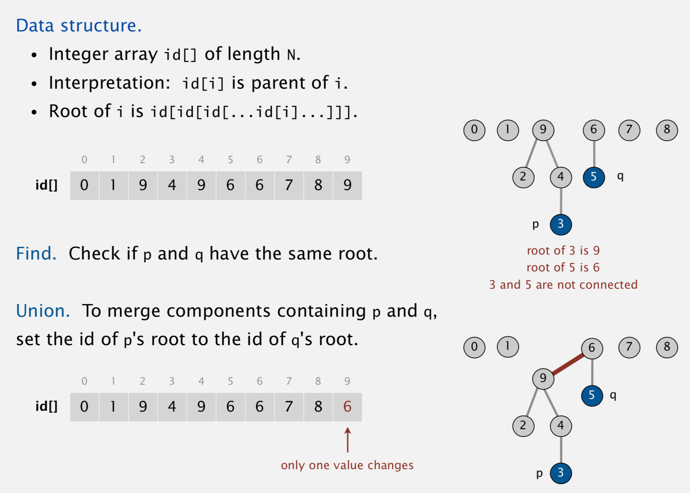

# UNION FIND: DYNAMIC CONNECTIVITY 
- `Quick Find`
- Quick Union
- Improvement: Weighted Quick Union
- Improvement: Weighted Quick Union + Path Compression
- Application: Percolations

## Problem: Is there a path connecting `p` and `q` ?
- Given a set of N objects
  - `union(p, q)` : a function that connects two objects
  - `connected(p, q)` : a function that returns where or not there is a path connecting the two specified objects 
  - Once two nodes are connected they can't be `unconnected`

# QUICKFIND (EAGER APPROACH)
## QuickFind Data Structure
- Integer Array `ids[]` of length N 
- Interpretation: `p` and `q` are connected if and only if they have the same ID

##  QuickFind Disadvantage: Expensive `union()` operation
- `N` union commands on `N` nodes takes `N^2` time, 
- It will take a lot of time to connect a lot of nodes

# QUICKUNION (LAZY APPROACH)
## QuickUnion Data Structure
- Integer array `id[]` of length `N` 
- Interpretation: `id[i]` is parent of `i`.
- Root of `i` is `id[id[id[...id[i]...]]]`.
- If `p` and `q` have the same root, then they are connected 
- To merge components containing `p` and `q`, set the `id` of `p`'s root to the `id` of `q`'s root.
##  Quick Union Disadvantage
- Trees can get too tall which means finding out if two nodes are `connected()` can get too expensive

# QUICK FIND vs QUICK UNION 

