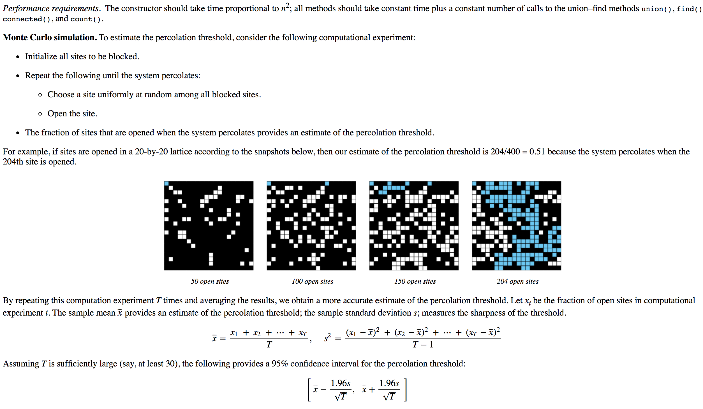
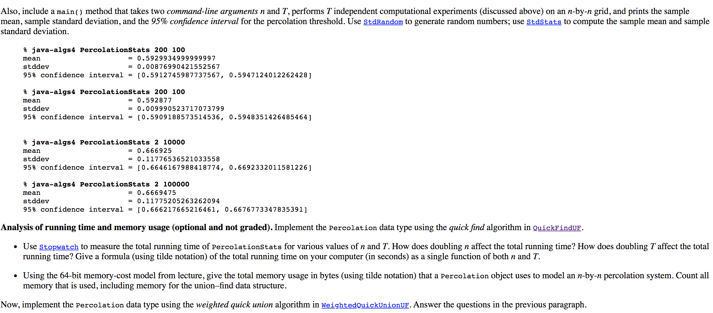

# Percolation Assignment
- Problem statement found here: http://coursera.cs.princeton.edu/algs4/assignments/percolation.html

## HOW TO USE
- Must have `jupyter`, `numpy`, and `random`
- Sample usage in the following notebooks are pretty much self explanatory: 
  - https://github.com/mithi/algorithm-playground/blob/master/princeton-course/L2-percolation/n1-percolation-simulations.ipynb
  - https://github.com/mithi/algorithm-playground/blob/master/princeton-course/L2-percolation/n2-percolation-tests-5x5.ipynb

## TODO 

1. Implement the following classes in RUST and/or C++
- Percolation Grid
- Percolation Stats
- Quick Find
- Quick Union 
- Weighted Quick Union 
- Weighted Quick Union with Path Compression - Single Pass
- Weighted Quick Union with Path Compression - Two Pass

2. Experiment, Analysis and Benchmark Tests
- Compare and contrast Union Find implementations holding constant different sizes of grids and number of of trials 

3. Visualization with BOKEH 
- Visualization of Percolation, opening random sites
  - Similar to the following video: https://www.youtube.com/watch?v=4pYvVtO1WxI 
- Graphs of percolation stats (grid size, number of trials)
- Graphs of benchmarks 

