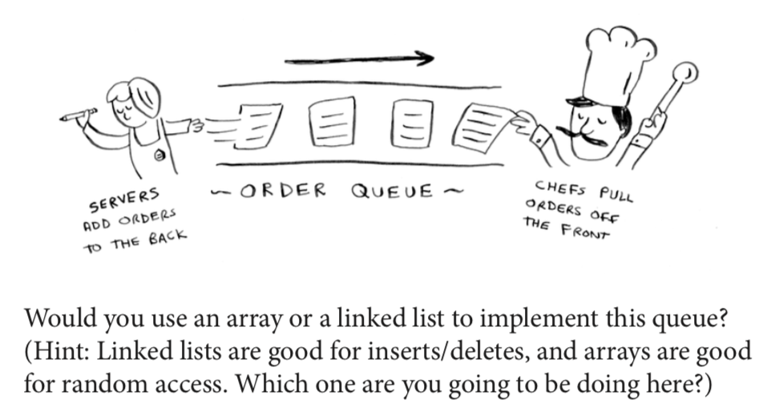

# TODO: Basic Algorithm Analysis 
- Implement binary search 
- 3-sum problem: brute-force
- 3-sum problem: n^2 * log n
- Plot benchmarks of 3-sum problem 
- Plot graphs of order of growth (linear plot, log-log plot)

# TODO: Basic Sequential Data Structure Implementations (c++?) 
- Stack
  - Singly-link list
  - Resizing Array
  
- Queue 
  - Double resizing array with rebalancing 
  - Circular Resizing Array 
  - Singly-link list

- Deque
  - How it's done with C++ STL (chunks of contiguous memory)
  - Double resizing array with rebalancing 
  - Doubly linked lists

- Sparse Matrix with Singly-List List
  - Use singly-linked list to implement sparse matrix 
  - [When to use C++ Forward List](https://stackoverflow.com/questions/25472527/when-to-use-c-forward-list)
  - [Sparse Matrix](https://www.wikiwand.com/en/Sparse_matrix)

# Stack, Queues, Deques, Bags

- BAG 
  - you can `add` items inside it, order doesn't matter
  - when iterating over them order doesn't matter `for each marble in bag`

- STACK (Last-in, First-out)
  - `push()`, `pop()`, `peek()`, `is_empty`, `size`, `iterator`

- QUEUE (First-in, First-out)
  - `enqueue()`, `dequeue()`, `peek()`, `is_empty`, `size`, `iterator`

- DEQUE
  - `add_front()`, `add_back()`
  - `remove_front()`, `remove_back()`
  - `peek_front()`, `peek_front()`
  - `is_empty`, `size`, `iterator`

# Simplest Sequential Data Structures
- Doubly linked list
- Singly linked list
- Fixed-Size Contiguous Array 
- Hybrid of linked list and fixed array
  - An array of linked list
  - A linked list of arrays

# Rule of thumb: linked list vs Array
- Arrays are BEST for fast random access at any index
- Linked lists are BEST when: 
  - you do a lot of inserts and deletes 
  - you don't have a good estimated range before hand how many items you will have
     - if the array grows too big, you will have to declare and copy memory elsewhere
  - you pretty much just access things sequentially
- Inserting at the middle
  - With linked list, change which previous elements point to (search-time + o(1))
  - With arrays you have to shift the rest of the elements down (o(n))
- Time Predictability of Insertions
  - Arrays: Inserts are the tail are amortized o(1), because if you are 
  at the end of the array and you need to double it, then you have to copy 
  everything, so it's fast insert most of the time, but every so often it's not as fast
  - Linkedlist: much slower than array but predictable

# Sources 
- [Stack Overflow: When to use a linked list over an array/array list?
](https://stackoverflow.com/questions/393556/when-to-use-a-linked-list-over-an-array-array-list)
- [Stack Overflow: Array vs Linked List](https://stackoverflow.com/questions/166884/array-versus-linked-list?noredirect=1&lq=1)
- Images from [Grokking Algorithms](https://www.amazon.com/Grokking-Algorithms-illustrated-programmers-curious/dp/1617292230)
- [Carnegie Mellon Adam Chik](http://www.cs.cmu.edu/~adamchik/15-121/lectures/),
  - [Stacks and Queues](http://www.cs.cmu.edu/~adamchik/15-121/lectures/Stacks%20and%20Queues/Stacks%20and%20Queues.html),
  [Linked list](http://www.cs.cmu.edu/~adamchik/15-121/lectures/Linked%20Lists/linked%20lists.html),
  [Arrays](http://www.cs.cmu.edu/~adamchik/15-121/lectures/Arrays/arrays.html)
- [Open Data Structures](http://opendatastructures.org/)
  - [Linked List](http://opendatastructures.org/ods-python/3_Linked_Lists.html), 
    [Queues and Stacks with Arrays](http://opendatastructures.org/ods-python/2_Array_Based_Lists.html)

